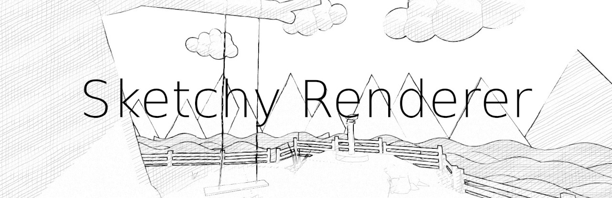

# Sketchy Renderer

</img>

 A third person game made in Godot with a sketchy screen shader.
 This project can be used as a starting point or as a reference for making certain systems in Godot.

 [You can play the game on Itch.io!](https://gyrthmcmulin.itch.io/sketchy-renderer)

 ## Features

* Character controller with smooth animation blending and orbital camera system.
* Spatial shader that reads from the screen and normal texture to apply post processing.
* Character selection screen before the scene with gameplay is loaded.
* Transition from one scene to another by using a vignette zoom to black.
* A settings screen that changes the shader parameters of the sketchy shader.
* An obstruction checker that hides walls with a vignette effect to keep the player visible.
* Collecting items in the level and animating both the item and character when doing so.
* Debug/Media Mode camera that can be enabled at any time to record videos or inspect scenes.

## Credits

This project uses assets made by Kenney that are released under Creative Commons CC0.  
[View all the assets made by Kenney here.](https://www.kenney.nl/)

For audio effects the project uses assets from Sonniss' GDC Game Audio Bundle.  
[Sonniss.com](https://sonniss.com/)

## Videos

## Screenshots

